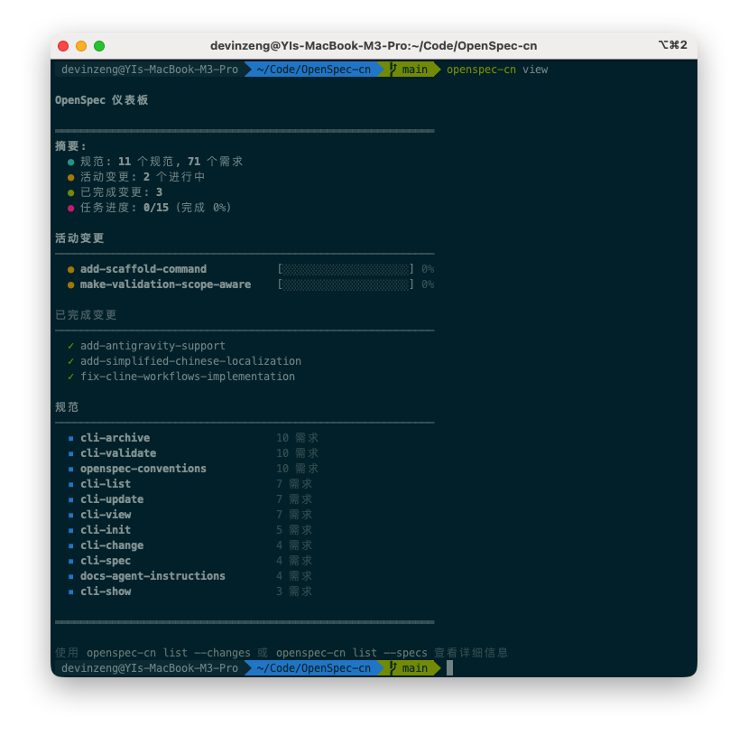

<p align="center">
  <a href="https://github.com/studyzy/openspec-cn">
    <picture>
      <source srcset="assets/openspec_bg.png">
      
    </picture>
  </a>
</p>

<p align="center">
  <a href="https://github.com/Fission-AI/OpenSpec/actions/workflows/ci.yml"></a>
  <a href="https://www.npmjs.com/package/@studyzy/openspec-cn"></a>
  <a href="./LICENSE"></a>
  <a href="https://discord.gg/YctCnvvshC"></a>
</p>

> [!NOTE]
> 本项目为中文汉化分支：**openspec-cn**（npm：`@studyzy/openspec-cn`）。
>
> 原版项目：OpenSpec
> 仓库：https://github.com/Fission-AI/OpenSpec
> npm：`@fission-ai/openspec` <a href="https://www.npmjs.com/package/@fission-ai/openspec"></a>


<details>
<summary><strong>最受喜爱的规范（spec）框架。</strong></summary>

[](https://github.com/studyzy/openspec-cn/stargazers)
[](https://www.npmjs.com/package/@studyzy/openspec-cn)
[](https://github.com/studyzy/openspec-cn/graphs/contributors)

</details>
<p></p>
我们的理念：

```text
→ 灵活，而非僵化
→ 迭代，而非瀑布式
→ 简单，而非复杂
→ 面向存量项目（brownfield），而不只是新项目（greenfield）
→ 从个人项目到企业规模都可扩展
```

> [!TIP]
> **全新工作流现已上线！** 我们用一种全新的"以制品（artifact）为导向"的工作流重构了 OpenSpec。
>
> 运行 `/opsx:propose "你的想法"` 开始使用。→ [在此了解更多](docs/opsx.md)

<p align="center">
  关注 <a href="https://x.com/0xTab">X 上的 @0xTab</a> 获取更新 · 加入 <a href="https://discord.gg/YctCnvvshC">OpenSpec Discord</a> 获取帮助与答疑。
</p>

<!-- TODO: 添加 /opsx:propose → /opsx:archive 工作流的 GIF 演示 -->

## 看看效果

```text
你：/opsx:explore
AI：  你想探索什么？
你：我想做深色模式，但不确定怎么搞才干净。
AI：  让我看看你的样式方案...
     最干净的路径：CSS 变量 + 一个小型主题上下文，
     加上系统偏好检测。不需要新依赖。要划定范围吗？
你：好，开始吧。

你：/opsx:propose add-dark-mode
AI：已创建 openspec/changes/add-dark-mode/
     ✓ proposal.md — 为什么要做这个，什么在变
     ✓ specs/       — 需求和场景
     ✓ design.md    — 技术方案
     ✓ tasks.md     — 实现清单
     准备好开始实现了！

你：/opsx:apply
AI：开始实现任务...
    ✓ 1.1 添加主题上下文 Provider
    ✓ 1.2 创建切换组件
    ✓ 2.1 添加 CSS 变量
    ✓ 2.2 接入 localStorage
    所有任务已完成！

你：/opsx:archive
AI：已归档至 openspec/changes/archive/2025-01-23-add-dark-mode/
    Specs 已更新。可以开始下一个功能了。
```

<details>
<summary><strong>What do the specs actually look like?</strong></summary>

Plain Markdown — requirements with concrete scenarios, no special syntax to learn. Here's what goes in the `specs/` folder created above:

```markdown
## ADDED Requirements

### Requirement: Theme selection
The app SHALL let users switch between light and dark themes,
defaulting to the system preference.

#### Scenario: User toggles dark mode
- **WHEN** the user clicks the theme toggle
- **THEN** the app switches to dark mode and persists the choice
```

Your AI writes these; you review the plan before any code is written.

OpenSpec is built with OpenSpec — browse this repo's live [specs](openspec/specs) and in-flight [changes](openspec/changes) for real examples at scale.

</details>

<details>
<summary><strong>OpenSpec 仪表盘</strong></summary>

<p align="center">
  
</p>

</details>

## 团队为何采用 OpenSpec

单人开发时，OpenSpec 让你和你的 AI 在同一个仓库里保持诚实。在团队中，难点转移了：一个功能横跨 API 服务、Web 应用和一个共享库；需求由一个团队拥有，却被其他团队消费；规划在你写任何代码之前就已经开始。

**[Stores](docs/stores-beta/user-guide.md)** 就是答案 —— 把规划放到一个独立的仓库里。你熟悉的 `openspec/` 形态（specs 和 changes）原样保留，通过 `git push` 像其他东西一样共享。整个团队和每个编码代理都能跨仓库读取的单一事实来源。

- **跨仓库功能** —— 一个变更、一个计划，即使代码落在三个仓库里。
- **共享需求** —— 平台团队拥有 specs；产品团队以只读方式引用它们，就在编码代理能读到的地方。不再有漂移的 wiki。
- **先规划后编码** —— 现在把计划捕获到 store 中；代码仓库随后跟上。

> Stores 目前处于 **beta** 阶段。请从 [Stores 用户指南](docs/stores-beta/user-guide.md) 开始。

## 快速开始

**需要 Node.js 20.19.0 或更高版本。**

全局安装 openspec-cn：

```bash
npm install -g @studyzy/openspec-cn@latest
```

然后进入你的项目目录并初始化：

```bash
cd your-project
openspec-cn init
```

> **Want your AI to do it?** Paste the [setup prompt](docs/installation.md#install-with-your-ai-assistant) into your coding assistant — it installs the CLI, runs `openspec init`, and verifies the result.

Now talk to your AI:

- **还不确定要构建什么？** 先用 `/opsx:explore`，一个无风险的思考伙伴，它会阅读你的代码、权衡方案、在写任何东西之前帮你理清思路。（[探索指南](docs/explore.md)）
- **已经知道自己想要什么？** 直接用 `/opsx:propose <你想要构建的内容>`。

这两者都在默认 profile 中。如果你想要扩展工作流（`/opsx:new`、`/opsx:continue`、`/opsx:ff`、`/opsx:verify`、`/opsx:bulk-archive`、`/opsx:onboard`），请通过 `openspec-cn config profile` 选择，然后运行 `openspec-cn update` 应用。

`/opsx:propose` is the canonical name; your tool may spell it `/opsx-propose` (Cursor, GitHub Copilot), `@opsx-propose` (Amazon Q) or `$openspec-propose` (Codex). `openspec init` prints the right form for the tools you picked — see [How To Invoke](docs/supported-tools.md#how-to-invoke).

> [!NOTE]
> Not sure if your tool is supported? [View the full list](docs/supported-tools.md) – we support 30+ tools and growing.
>
> 同样支持 pnpm、yarn、bun 和 nix。可查看 [安装选项](docs/installation.md)。

## 文档

**从这里开始：** 查看 **[文档首页](docs/README.md)** 获取全貌。刚接触 OpenSpec？先读 [快速入门](docs/getting-started.md)，然后看 [命令如何工作](docs/how-commands-work.md)（了解 `/opsx:propose` 在哪里输入）。

→ **[快速入门](docs/getting-started.md)**：第一步<br>
→ **[先探索](docs/explore.md)**：用 `/opsx:explore` 想清楚再动手<br>
→ **[命令如何工作](docs/how-commands-work.md)**：斜杠命令在哪运行 vs CLI<br>
→ **[核心概念一览](docs/overview.md)**：一页看懂整个心智模型<br>
→ **[示例与菜谱](docs/examples.md)**：真实变更，从开始到完成<br>
→ **[工作流](docs/workflows.md)**：组合与模式<br>
→ **[存量项目](docs/existing-projects.md)**：在已有代码库中引入 OpenSpec<br>
→ **[编辑变更](docs/editing-changes.md)**：更新制品、回退、处理手动编辑<br>
→ **[命令](docs/commands.md)**：斜杠命令与技能<br>
→ **[CLI](docs/cli.md)**：终端参考手册<br>
→ **[Stores](docs/stores-beta/user-guide.md)**：在独立仓库中规划，团队共享（Beta）<br>
→ **[支持的工具](docs/supported-tools.md)**：工具集成与安装路径<br>
→ **[概念](docs/concepts.md)**：整体如何运转<br>
→ **[多语言](docs/multi-language.md)**：多语言支持<br>
→ **[自定义](docs/customization.md)**：打造你的版本<br>
→ **[FAQ](docs/faq.md)** · **[故障排查](docs/troubleshooting.md)** · **[术语表](docs/glossary.md)**：快速帮助


## 社区 Schema

通过独立仓库分发的第三方 Schema 包 —— 它们提供了将 OpenSpec 与其他工具集成的特定工作流，类似于 [github/spec-kit 的社区扩展目录](https://github.com/github/spec-kit/tree/main/extensions) 处理工具集成的方式。

→ **[浏览目录](docs/customization.md#community-schemas)**，详见自定义文档。


## 为什么选择 OpenSpec？

AI 编程助手很强大，但当需求只存在于聊天记录里时，结果往往难以预测。OpenSpec 增加了一层轻量的规范（spec）机制，让你在写任何代码前先对齐要做什么。

- **构建前先达成共识** —— 在写代码前，人类和 AI 先在 specs 上对齐
- **保持有序** —— 每个变更都有自己的文件夹，内含 proposal、specs、design 和 tasks
- **流畅协作** —— 随时更新任意制品，没有僵化的阶段门槛
- **使用你的工具** —— 通过斜杠命令与 30+ 种 AI 助手协作

### 我们如何对比

**对比 [Spec Kit](https://github.com/github/spec-kit)**（GitHub）—— 很全面但偏厚重：阶段门槛严格、Markdown 很多、需要 Python 环境。OpenSpec 更轻量，也更适合自由迭代。

**对比 [Kiro](https://kiro.dev)**（AWS）—— 功能强大，但会被锁定在他们的 IDE 中，并且模型选择受限（主要是 Claude）。OpenSpec 可与您已有的工具协作。

**对比“什么都不用”** —— 只靠聊天做 AI 编程容易产生模糊需求和不可预测的实现。OpenSpec 在不增加太多仪式感的前提下，带来更可预期的结果。

## 更新 OpenSpec

**升级包版本**

```bash
npm install -g @studyzy/openspec-cn@latest
```

**刷新代理指令（agent instructions）**

在每个项目里运行一次，用于重新生成 AI 指引，并确保最新斜杠命令可用：

```bash
openspec-cn update
```

## 使用注意事项

**模型选择**：OpenSpec 更适合高推理模型。我们推荐在规划与实现阶段都使用 Codex 5.5 和 Opus 4.7。

**上下文卫生**：OpenSpec 受益于更干净的上下文窗口。在开始实现前清理上下文，并在整个会话中保持良好的上下文卫生。

## 参与贡献

**小修小补** —— Bug 修复、错别字修正与小型改进可以直接提交 PR。

**汉化问题** —— 因为汉化导致的 Bug 修复、错别字修正与小型改进建议可以直接提交 [Issue](https://github.com/studyzy/OpenSpec-cn/issues)。

**较大改动** —— 对于新功能、重大重构或架构调整，请先提交一个 OpenSpec 变更提案，以便在实现前对齐意图与目标。

撰写提案时，请牢记 OpenSpec 的理念：我们服务于各种不同的编码代理、模型与使用场景。改动应对所有人都工作良好。

**欢迎 AI 生成代码** —— 只要经过测试与验证即可。包含 AI 生成代码的 PR 应注明使用的编码代理与模型（例如："Generated with Claude Code using claude-opus-4-5-20251101"）。

### 开发

- 安装依赖：`pnpm install`
- 构建：`pnpm run build`
- 测试：`pnpm test`
- 本地开发 CLI：`pnpm run dev` 或 `pnpm run dev:cli`
- 约定式提交（单行）：`type(scope): subject`

## 其他

<details>
<summary><strong>遥测（Telemetry）</strong></summary>

OpenSpec 会收集匿名使用统计。

我们只收集命令名与版本号，用于理解使用模式；不会收集参数、路径、内容或任何个人信息。CI 中会自动禁用。

**Opt-out (any one is enough):**
- `openspec config set telemetry.enabled false` (global config; unset means on)
- `export OPENSPEC_TELEMETRY=0` or `export DO_NOT_TRACK=1` (env overrides config)

</details>

<details>
<summary><strong>维护者与顾问</strong></summary>

核心维护者与顾问列表见 [MAINTAINERS.md](MAINTAINERS.md)。

</details>


## 许可证

MIT
