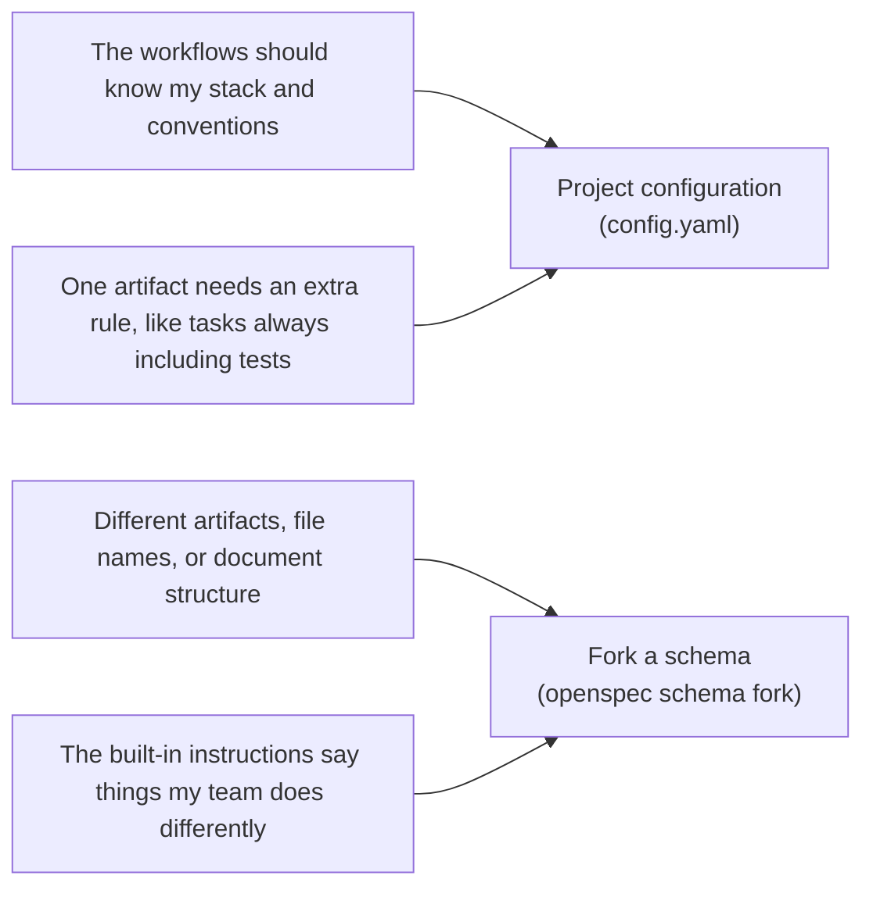

# 概述

> 定制 OpenSpec 的选项。

OpenSpec 支持多种定制选项。本页说明每一项改变什么，以及何时使用。

## 你可以定制什么

| 选项 | 改变什么 | 何时使用 |
|---|---|---|
| [Profiles](profiles.md) | 安装哪些工作流，以及以 skills、commands 还是两者形式安装 | 你想要额外的工作流和工作模式，或移除不需要的工作流 |
| [项目配置](project-config.md) | 注入到每次工作流运行的指令：context、rules 和操作指引（`config.yaml`） | 你想按自己的方式规划变更，比如任务总是包含 Playwright 测试 |
| [Schemas](schemas.md) | OpenSpec 产出什么：制品、它们的顺序和模板 | 变更应该产出不同的规划文件、章节或格式 |

## 不确定该用哪个？

config 和 schemas 是两个层次的定制。按你想亲自动手的程度选择：

- **从[项目配置](project-config.md)开始**：它更轻量，对大多数项目来说就够了。你保留标准制品，并在其上添加自己的 context 和 rules。
- **在"添加"不够用时 fork 一个[schema](schemas.md)**：config 只在核心工作流之上做加法。它可以加一条像"任务总是包含测试"这样的规则，但不能去掉 design 文档或重命名文件。那是 schema 的领域。Fork 给你一份可以自己编辑的副本。

*这里的 "fork" 指 `openspec-cn schema fork` 命令，而不是 fork 一个 git 仓库。[Schemas](schemas.md) 有详细说明。*

