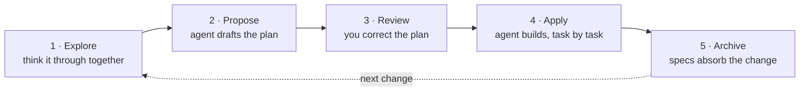

# 快速入门

> 在现有仓库上完成你的第一个变更，从想法到归档。

开始之前，你需要在本机安装 CLI（[安装](installation.md)），并在项目中初始化 OpenSpec（[设置你的项目](setup.md)）。

## 循环一览

每个变更都经过相同的五个步骤：你先和你的 Agent 一起把想法想清楚，它起草计划，在代码尚未存在时你修正计划，Agent 据此构建，最后归档把实际交付的内容更新到 specs 中。



下面的每个提示词都输入到你的 AI 聊天框中，也就是你让 AI 写代码的那个输入框。每个提示词都按名称调用一个 OpenSpec skill，在任何工具中拼写都相同。直接说一句普通的话也可以（"propose a change to add rate limiting"）。有些工具提供了更短的命令别名（Claude Code 中是 `/opsx:propose`，[其他工具各不相同](../reference/supported-tools.md)）。

## 第 1 步：探索

在要计划之前，先和你的 Agent 一起把想法想清楚。在 AI 聊天框中输入：

```text
/openspec-explore how rate limiting should work in this app
```

探索是一种思考模式。Agent 会调查你的代码库、提出关键问题、勾勒备选方案并挑战假设。它不写任何代码，也不创建任何文件。产出是一个更清晰的想法。

在问题需要时一直停留在这个阶段。当形态感觉合适时，就交接给提案：

```text
/openspec-propose
```

这一行会替你启动提案，并带着你已经确定的所有内容。跳过第 2 步中的第一个提示词。

## 第 2 步：提案

提案把想法变成一份可评审的计划。如果从探索过来，它已经在运行了。如果是冷启动，当变更在你脑中已经清晰时，直接提问。在 AI 聊天框中输入：

```text
/openspec-propose add rate limiting
```

Agent 会问它需要了解的问题，然后写入一个变更文件夹：

```
openspec/changes/add-rate-limiting/
├── proposal.md    why, and what changes
├── specs/         what "done" means, as testable requirements
├── design.md      technical decisions (only when the change needs one)
└── tasks.md       the implementation checklist
```

还没有任何代码。提案止步于计划。

## 第 3 步：评审并修正计划

趁计划还只是一些文字、什么都没构建时修正它。按这个顺序阅读：

- **`proposal.md`**：这是正确的问题吗？规模合适吗？
- **`specs/`**：价值最高的阅读。你会把这些需求当作"完成"来接受吗？
- **`tasks.md`**：任务是否覆盖了 specs，且没有超出？

要修正某个地方，两种方式都行：

- 自己编辑文件。制品就是纯 Markdown，而文件就是计划本身。
- 告诉你的 Agent 哪里不对（"spec 缺少未认证的情况"）。它会修订制品。

## 第 4 步：实施

实施把计划变成代码。开一个新的会话，因为在干净的上下文窗口上实施效果更好。在 AI 聊天框中输入：

```text
/openspec-apply-change add-rate-limiting
```

Agent 读取变更文件夹，然后按 `tasks.md` 逐项推进，每完成一项就勾选一项。

- **被打断或上下文耗尽？** 开一个新会话让它再次实施。它会从第一个未勾选的任务继续。
- **计划原来就错了？** 修正制品（第 3 步的任一方式），然后继续实施。
- **进度**保存在 `tasks.md` 的复选框里。没有任何隐藏状态。

## 第 5 步：归档

归档做两件事：把变更的需求合并进你的主 specs，并把变更文件夹移入归档文件夹（在 `/openspec/changes/archive/*` 下）。

当 `tasks.md` 中的每个复选框都被勾选后，在 AI 聊天框中输入：

```text
/openspec-archive-change add-rate-limiting
```

逐步看一下归档做了什么：

```file-steps
## The finished change
> Implementation is done. The delta spec (what this change adds) still sits inside the change folder; specs/ doesn't know about rate limiting yet.
  openspec/
  ├── specs/                                   (no rate-limiting spec yet)
  └── changes/
      └── add-rate-limiting/
          ├── proposal.md
          ├── tasks.md                         every box checked
          └── specs/
              └── rate-limiting/
                  └── spec.md                  the delta: ADDED requirements

## Requirements land in specs/
> Each requirement in the delta lands in the main spec: added ones append, modified ones replace their old version. A new capability gets a new spec file.
  openspec/
  ├── specs/
+ │   └── rate-limiting/
+ │       └── spec.md                          gains "Requirement: Rate limiting"
  └── changes/
      └── add-rate-limiting/
          └── specs/
              └── rate-limiting/
                  └── spec.md                  the delta, source of the merge

## The folder moves to archive/
> The whole change folder, delta included, moves into the archive under a date prefix. Nothing is deleted.
  openspec/
  ├── specs/
  │   └── rate-limiting/
  │       └── spec.md
  └── changes/
-     └── add-rate-limiting/
+     └── archive/
+         └── 2026-08-08-add-rate-limiting/
+             ├── proposal.md
+             ├── tasks.md
+             └── specs/rate-limiting/spec.md

## Specs describe the system as built
> changes/ is clear for the next change. specs/ is the source of truth for what the system does; archive/ is the history of how it got there.
  openspec/
  ├── specs/
  │   └── rate-limiting/
  │       └── spec.md                          the spec as built
  └── changes/
      └── archive/
          └── 2026-08-08-add-rate-limiting/
```

Git 是另一件独立的事。把变更文件夹和代码一起提交，除此之外你的工作流没有任何变化。归档相对于 PR 的时机是团队约定；[团队](../guides/teams.md) 指南里有相应的权衡。

## 更进一步

- [概念](../guides/concepts.md)：两种制品各是什么，增量（delta）如何描述一个变更。
- [探索](../guides/explore.md)：更好地发挥探索模式。
- [实施](../guides/apply.md)：节奏、上下文窗口、长变更的续跑。
- [评审计划](../guides/review-the-plan.md)：在构建前，specs 里要看什么。
- [Profiles](../customize/profiles.md)：核心集之外的可选工作流（归档前验证、增量规划）。

## 高级指南

<!-- Planned pages, not yet written or in the README page map. Listed here so the quickstart routes to them once they exist. -->

尚未编写；我们计划增加的指南：

- **先做原型**：在写任何 spec 之前先粗写代码，然后从原型中学到的东西反向补全 proposal。
- **迭代式构建**：一系列小变更，而不是一个大 proposal。
- **修订已实施的变更**：实施之后计划又需要调整，但变更尚未合并或归档。
