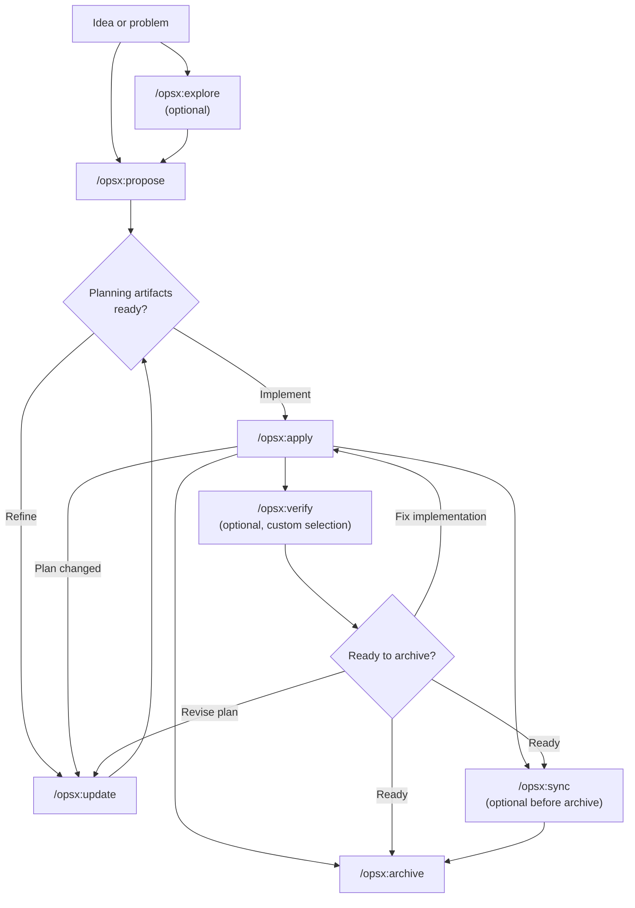

# 工作流

本指南介绍 OpenSpec 常见的工作流模式，以及每种模式的使用时机。基础配置请参见 [Getting Started](getting-started.md)，命令参考请参见 [Commands](commands.md)。

## 理念：动作，而非阶段

传统工作流强迫你依次经历阶段：规划，然后实现，然后完成。但真实的工作并不能整齐地塞进这些框框。

OPSX 采取了不同的思路：

```text
传统（阶段锁定）：

 PLANNING ────────► IMPLEMENTING ────────► DONE
 │                          │
 │       "无法回头"          │
 └──────────────────────────┘

OPSX（流动的动作）：

 proposal ──► specs ──► design ──► tasks ──► implement
```

**核心原则：**

- **动作，而非阶段** —— 命令是你所做的事情，而不是你被困其中的阶段。
- **依赖是赋能者** —— 它告诉你什么是可行的，而不是下一步必须做什么。

> **自定义：** OPSX 工作流由 schema 驱动，schema 定义了制品的顺序。关于创建自定义 schema 的详情，请参见 [Customization](customization.md)。

## Workflow at a Glance

The default workflow stays fluid: exploration and verification are optional, and
you can update planning artifacts whenever implementation reveals something new.



The AI assistant drives the workflow, while the CLI provides deterministic
scaffolding, status, and artifact instructions:

```mermaid
sequenceDiagram
    actor Human
    participant Assistant as AI assistant
    participant CLI as OpenSpec CLI
    participant Files as Planning and implementation files

    Human->>Assistant: /opsx:propose "change"
    Assistant->>CLI: openspec new change
    CLI->>Files: Scaffold change metadata
    Assistant->>CLI: Request status and artifact instructions
    CLI-->>Assistant: Build order, paths, and templates
    Assistant->>Files: Write schema-defined planning artifacts
    Assistant-->>Human: Present artifacts for review

    Human->>Assistant: /opsx:apply
    Assistant->>CLI: Request apply instructions
    CLI-->>Assistant: Context files and task state
    Assistant->>Files: Implement tasks and update checkboxes
    Assistant-->>Human: Report implementation status

    Human->>Assistant: /opsx:archive
    Assistant->>CLI: Request archive inputs and artifact status
    CLI-->>Assistant: Planning paths and artifact completion
    Assistant->>Files: Read task state and compare delta specs
    opt Delta specs exist
        Assistant-->>Human: Offer to sync before archiving
        alt Sync accepted
            Human->>Assistant: Confirm sync
            Assistant->>Files: Merge delta specs into main specs
        else Sync skipped
            Human->>Assistant: Archive without syncing
        end
    end
    Assistant->>Files: Move the change into the archive
    Assistant-->>Human: Report archive location and sync result

    Note over Human,CLI: CLI alternative: openspec archive change-name --yes skips confirmation prompts; it still validates, then applies any delta specs and archives
```

## Two Modes

### 默认快速路径（`core` profile）

新安装默认使用 `core`，它提供：

- `/opsx:explore`
- `/opsx:propose`
- `/opsx:apply`
- `/opsx:update`
- `/opsx:sync`
- `/opsx:archive`

典型流程：

```text
/opsx:explore ──► /opsx:propose ──► /opsx:apply ──► /opsx:sync ──► /opsx:archive
 (可选)
```

#### 从探索开始（值得养成的习惯）

`/opsx:explore` 是默认 profile 的一部分，而非高级功能。探索不会创建任何制品，也不会写入任何代码。它是一场零风险的对话，能把模糊的担忧变成精确的变更，因此提案会更有针对性。如果你已经确切知道想要什么？跳过它，直接 `/opsx:propose`。完整指南见 [Explore First](explore.md)。

### 扩展/完整工作流（自定义选择）

如果你想使用显式的"搭建并构建"命令（`/opsx:new`、`/opsx:continue`、`/opsx:ff`、`/opsx:verify`、`/opsx:bulk-archive`、`/opsx:onboard`），用以下方式启用：

```bash
openspec-cn config profile
openspec-cn update
```

## 工作流模式（扩展模式）

### 快速功能

当你已经知道要构建什么，只是需要执行时：

```text
/opsx:new ──► /opsx:ff ──► /opsx:apply ──► /opsx:verify ──► /opsx:archive
```

**示例对话：**

```text
You: /opsx:new add-logout-button

AI: Created openspec/changes/add-logout-button/
 Ready to create: proposal

You: /opsx:ff

AI: Creating all planning artifacts...
 ✓ proposal.md
 ✓ specs/
 ✓ design.md
 ✓ tasks.md
 Ready for implementation!

You: /opsx:apply

AI: Working through tasks...
 ✓ Added logout button to header
 ✓ Implemented session clearing
 ✓ Added confirmation dialog
 All tasks complete!

You: /opsx:archive

AI: ✓ Merged specs
 ✓ Archived change
```

**最适合：** 中小型功能、缺陷修复、直截了当的变更。

### 探索式

当需求不清晰，或者你需要先调研时：

```text
/opsx:explore ──► /opsx:new ──► /opsx:continue ──► ... ──► /opsx:apply
```

**示例对话：**

```text
You: /opsx:explore

AI:  What would you like to explore?

You: I want to improve page load performance but I'm not sure
     where the bottlenecks are.

AI:  Let me help investigate...
     [Analyzes bundle sizes, identifies slow queries, reviews
     component render patterns]

     I found three main bottlenecks:
     1. Large unoptimized images
     2. Synchronous data fetching in ProductList
     3. Re-renders from context changes

     Which would you like to address first?

You: Let's tackle the data fetching issue.

You: /opsx:new optimize-product-list-fetching

AI:  Created change. Ready to create: proposal

You: /opsx:continue

AI:  Creating proposal based on our exploration...
     [Writes proposal incorporating investigation insights]

     Ready to create: specs, design
     Which would you like next?

You: /opsx:continue

AI:  Creating specs...
```

**最适合：** 性能优化、调试、架构决策、需求不清晰的情况。

### 并行变更

一次处理多个变更：

```text
Change A: /opsx:new ──► /opsx:ff ──► /opsx:apply (in progress)
                                         │
                                    context switch

Change B: /opsx:new ──► /opsx:ff ──────► /opsx:apply
```

**示例对话：**

```text
You: I'm working on add-dark-mode but got pulled into a bug fix

You: /opsx:new fix-login-redirect

AI: Created openspec/changes/fix-login-redirect/

You: /opsx:ff

AI: ✓ Created planning artifacts

You: /opsx:apply

AI: Working on fix-login-redirect...
 [Implements fix]
 All tasks complete!

You: /opsx:archive

AI: ✓ Archived fix-login-redirect

You: Let's go back to dark mode

You: /opsx:apply add-dark-mode

AI: Resuming add-dark-mode...
 Picking up task 2.3: Update Header...
```

**最适合：** 并行工作流、紧急中断、团队协作。

当你有多个已完成的变更时，使用 `/opsx:bulk-archive`：

```text
You: /opsx:bulk-archive

AI: Found 3 completed changes:
 - add-dark-mode (all tasks done)
 - fix-login-redirect (all tasks done)
 - update-footer (all tasks done)
 Checking conflicts...
 ⚠ add-dark-mode and update-footer touch specs/ui/
 Inspecting codebase to resolve...
 Both changes implemented. Will apply in chronological order.
 Archive 3 changes?

You: Yes

AI: ✓ Archived add-dark-mode
 ✓ Archived fix-login-redirect
 ✓ Archived update-footer
 Specs merged in order: add-dark-mode → update-footer
```

批量归档会检测多个变更是否触及 specs，并通过检查实际已实现的内容来解决冲突。

### 完成变更

推荐的完成流程：

```text
/opsx:apply ──► /opsx:verify ──► /opsx:archive
 │              │                  │
 │         validates   prompts sync│
 implementation   if needed        │
```

#### 验证：检查工作成果

`/opsx:verify` 从三个维度验证实现是否与制品一致：

```text
You: /opsx:verify

AI: Verifying add-auth...

 COMPLETENESS
 ✓ All 12 tasks in tasks.md checked
 ✓ All requirements in specs have corresponding code
 ⚠ Scenario "Session timeout after inactivity" not tested

 CORRECTNESS
 ✓ Implementation matches spec intent
 ✓ Edge cases in scenarios handled
 ✓ Error states match spec definitions

 COHERENCE
 ✓ Design decisions reflected in structure
 ✓ Naming conventions consistent with design.md
 ⚠ Design mentions "event-driven" but implementation polls

 SUMMARY
 ─────────────────────────────
 Critical issues: 0
 Warnings: 2
 Ready to archive: Yes (with warnings)

 Recommendations:
 1. Add test for session timeout scenario
 2. Refactor to event-driven as designed, or update design.md
```

**验证检查的内容：**

| 维度 | 校验内容 |
|-----------|------------------|
| 完整性 (Completeness) | 所有任务完成、所有需求都已实现、场景已覆盖 |
| 正确性 (Correctness) | 实现符合 spec 意图、边界情况已处理 |
| 连贯性 (Coherence) | 设计决策体现在代码中、模式保持一致 |

验证不会阻止归档，但会暴露你可能想先解决的问题。

#### 归档：定稿变更

`/opsx:archive` 完成变更并将其移入归档：

```text
You: /opsx:archive

AI: Archiving add-auth...

 Artifact status:
 ✓ proposal.md exists
 ✓ specs/ exists
 ✓ design.md exists
 ✓ tasks.md exists (12/12 tasks complete)

 Delta specs: Not yet synced to main
 → Would you like to sync now?

You: Yes

AI: ✓ Synced specs to openspec/specs/auth/spec.md
 ✓ Moved to openspec/changes/archive/2025-01-24-add-auth/

 Change archived successfully.
```

归档会在 specs 未同步时提示。它不会因任务未完成而阻塞，但会发出警告。

## 何时使用什么

### `/opsx:ff` 与 `/opsx:continue`

| 情况 | 使用 |
|-----------|-----|
| 需求清晰，准备好构建 | `/opsx:ff` |
| 正在探索，想逐步审核 | `/opsx:continue` |
| 想在 specs 之前先迭代 proposal | `/opsx:continue` |
| 时间紧迫，需要快速推进 | `/opsx:ff` |
| 复杂变更，想要掌控力 | `/opsx:continue` |

**经验法则：** 如果你能提前描述完整范围，使用 `/opsx:ff`。如果你还在摸索方向，使用 `/opsx:continue`。

### 何时更新 vs. 重新开始

一个常见问题：更新已有变更何时合适，何时应该开新变更？

**在以下情况更新现有变更：**

- 意图相同，只是执行方式更精炼
- 范围收窄（先交付 MVP，其余后续再做）
- 学习驱动的修正（代码库实际情况与预期不同）
- 基于实现过程中的发现对设计做调整

**在以下情况开新变更：**

- 意图从根本上改变
- 范围爆炸式扩大，变成完全不同的工作
- 原变更可独立标记为"完成"
- 打补丁只会让事情更加混乱

```text
 ┌─────────────────────────────────────┐
 │ 是同一件事吗？ │
 └──────────────┬──────────────────────┘
                │
        ┌───────┴───────┐
        │               │
        ▼               ▼
   意图相同？         重叠 >50%？
   同一问题？         同一范围？
        │               │
   ┌────┴────┐     ┌────┴────┐
   │        │     │        │
  YES      NO     YES      NO
   │        │     │        │
   ▼        ▼     ▼        ▼
 UPDATE   NEW   UPDATE   NEW
```

**示例："添加暗色模式"**

- "还需要支持自定义主题" → 新变更（范围爆炸）
- "系统偏好检测比预期难" → 更新（意图相同）
- "先上线开关，偏好后续再做" → 更新后归档，再开新变更

## 最佳实践

### 保持变更聚焦

每个变更只包含一个逻辑工作单元。如果你在做"添加功能 X 同时还要重构 Y"，考虑拆成两个独立的变更。

**为什么重要：**

- 更易审阅和理解
- 归档历史更干净
- 可独立交付
- 必要时回滚更简单

### 对不清晰的需求使用 `/opsx:explore`

在承诺一个变更之前，先探索问题空间：

```text
You: /opsx:explore

AI:  What would you like to explore?

You: How should we handle rate limiting for our API?

AI:  Let me investigate your current setup and options...
     [Researches codebase, considers patterns]

     I see three approaches we could take:
     1. Middleware-based (simple, per-endpoint)
     2. Redis-backed (scalable, shared state)
     3. Token bucket per user (fair, complex)

     Your current stack suggests #1 or #2. What's your scale?
```

探索能在你创建制品之前理清思路。

### 归档前先验证

使用 `/opsx:verify` 检查实现是否与制品一致：

```text
You: /opsx:verify

AI:  Verifying add-dark-mode...

     ✓ All tasks in tasks.md are checked
     ✓ Requirements in specs have corresponding code
     ✓ Design decisions are reflected in implementation

     Ready to archive!
```

在收尾变更之前捕获不一致。

### 清晰地命名变更

好的命名让 `openspec-cn list` 更有用：

```text
Good:                          Avoid:
add-dark-mode                  feature-1
fix-login-redirect             update
optimize-product-query         changes
implement-2fa                  wip
```

## 命令快速参考

完整命令详情与选项，请参见 [Commands](commands.md)。

| 命令 | 用途 | 何时使用 |
|---------|---------|-------------|
| `/opsx:propose` | 创建变更 + 规划制品 | 快速默认路径（`core` profile） |
| `/opsx:explore` | 与 AI 一起梳理想法 | 不确定时从这里开始：需求不清晰、调研、对比方案 |
| `/opsx:new` | 启动变更脚手架 | 扩展模式，显式的制品控制 |
| `/opsx:continue` | 创建下一个制品 | 扩展模式，逐步创建制品 |
| `/opsx:ff` | 创建所有规划制品 | 扩展模式，范围清晰 |
| `/opsx:apply` | 实现任务 | 准备好写代码时 |
| `/opsx:verify` | 验证实现 | 扩展模式，归档之前 |
| `/opsx:sync` | 合并增量规范 | 扩展模式，可选 |
| `/opsx:archive` | 完成变更 | 所有工作完成 |
| `/opsx:bulk-archive` | 归档多个变更 | 扩展模式，并行工作 |

## 下一步

- [Writing Good Specs](writing-specs.md) - 一个强有力的需求与场景长什么样，以及如何合理控制变更规模
- [Reviewing a Change](reviewing-changes.md) - 写代码前对草案plan的两分钟检查
- [OpenSpec on a Team](team-workflow.md) - 变更如何对应分支和 pull request
- [Commands](commands.md) - 带选项的完整命令参考
- [Concepts](concepts.md) - 深入 specs、artifacts、schemas
- [Customization](customization.md) - 创建自定义工作流
